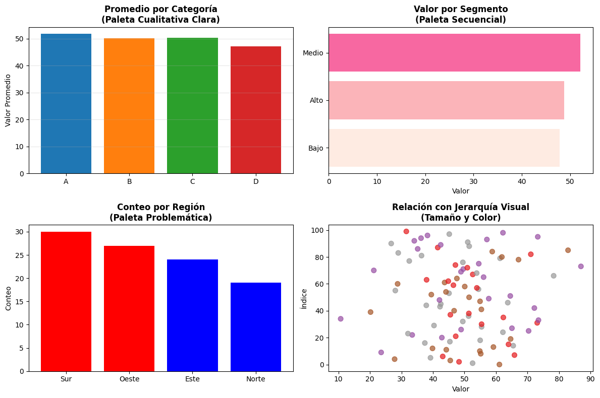
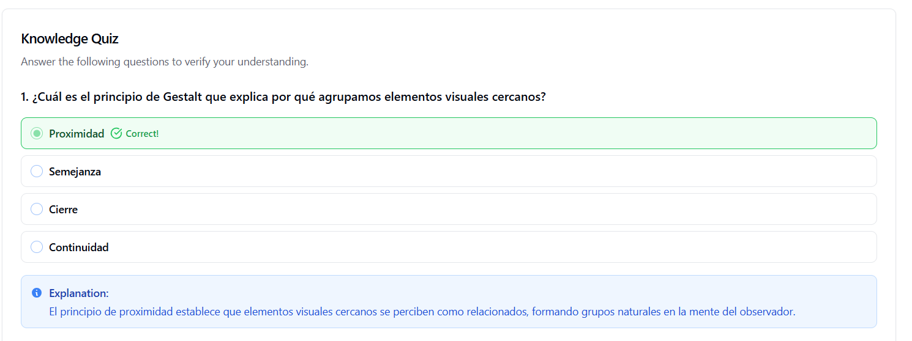

# Diseño de Paletas de Colores Efectivas para Visualización de Datos
| Autor            | Fecha        | Día |
|------------------|--------------|----------|
| **Carlos Vásquez** |11 diciembre 2025 | 1|

Ejercicio práctico para aprender a diseñar y aplicar paletas de colores efectivas en visualizaciones de datos.

## 📋 Descripción

Este ejercicio enseña a:
- Crear paletas de colores según el tipo de dato (cualitativas, secuenciales, divergentes)
- Aplicar principios visuales de jerarquía, color y composición
- Evaluar la accesibilidad de las visualizaciones

## 🛠️ Requisitos

```bash
pip install pandas numpy matplotlib seaborn
```

**Versiones recomendadas:**
- Python 3.7+
- Matplotlib 3.0+
- Pandas 1.0+
- NumPy 1.18+
- Seaborn 0.11+ (opcional)

## 🚀 Cómo Ejecutar

### Opción 1: En Terminal
```bash
python main.py
```

### Opción 2: En Jupyter Notebook

**Método A - Ejecutar archivo completo:**
```python
%matplotlib inline
%run main.py
```

**Método B - Ejecutar paso a paso:**
```python
# En la primera celda
%matplotlib inline
import pandas as pd
import numpy as np
import matplotlib.pyplot as plt

# Luego copiar y ejecutar cada sección del código
```

**Método C - Cargar y ejecutar:**
```python
with open('main.py', 'r') as f:
    exec(f.read())
```

## 📊 Contenido del Ejercicio

### 1. Dataset de Ejemplo

Se genera un dataset sintético con:
- **Categorías discretas**: A, B, C, D
- **Valores continuos**: Distribución normal
- **Segmentos ordenados**: Alto, Medio, Bajo
- **Regiones**: Norte, Sur, Este, Oeste

### 2. Tipos de Paletas

#### Paleta Cualitativa
```python
colores_cualitativos = ['#1f77b4', '#ff7f0e', '#2ca02c', '#d62728']
```
- **Uso**: Categorías sin orden natural
- **Características**: Colores distintivos con alto contraste

#### Paleta Secuencial
```python
colores_secuenciales = ['#feebe2', '#fbb4b9', '#f768a1', '#c51b8a', '#7a0177']
```
- **Uso**: Datos ordenados o valores continuos
- **Características**: Progresión gradual de intensidad

#### Paleta Divergente
```python
colores_divergentes = ['#d73027', '#fc8d59', '#fee08b', '#d9ef8b', '#91cf60', '#1a9850']
```
- **Uso**: Datos con punto medio significativo
- **Características**: Dos rampas de color desde un centro neutral

### 3. Gráficos Generados

El ejercicio crea 4 gráficos comparativos:

1. **Gráfico de barras con paleta cualitativa** ✓
   - Demuestra uso correcto de colores distintivos

2. **Gráfico horizontal con paleta secuencial** ✓
   - Muestra progresión lógica de valores

3. **Gráfico con paleta problemática** ✗
   - Ejemplo de errores comunes (colores redundantes)

4. **Scatter plot con jerarquía visual** ✓
   - Combina color, tamaño y transparencia

## ✅ Verificación: Análisis de Principios Visuales

### Preguntas para Reflexionar

Al revisar los gráficos generados, considera:

1. **¿Por qué el Gráfico 3 es problemático?**
   - Usa colores similares (rojo-rojo, azul-azul) para categorías diferentes
   - El usuario debe leer las etiquetas en lugar de distinguir visualmente
   - La visualización falla en su propósito: comunicar de forma visual

2. **¿Cuándo usar cada tipo de paleta?**
   - **Cualitativa**: Categorías discretas sin orden (regiones, tipos, marcas)
   - **Secuencial**: Valores de menor a mayor (temperatura, edad, cantidad)
   - **Divergente**: Valores con punto de referencia central (ganancia/pérdida, arriba/abajo del promedio)

3. **¿Cómo afecta la jerarquía visual a la interpretación?**
   - **Gráfico 2**: La intensidad de color guía naturalmente al valor más alto
   - **Gráfico 4**: El tamaño y color juntos crean capas de información
   - **Gráfico 1**: Los colores distintivos permiten comparación inmediata

### Principios Clave

#### 1. Jerarquía
- Colores más intensos atraen más atención
- La progresión visual debe coincidir con la progresión lógica de los datos

#### 2. Color
- **Funcional, no decorativo**: Cada color debe tener un propósito
- **Contraste suficiente**: Las diferencias deben ser obvias, no sutiles
- **Coherencia semántica**: Rojo-verde para positivo/negativo es intuitivo

#### 3. Composición
- **Grid sutil** (alpha=0.3): Proporciona referencia sin competir con los datos
- **Títulos descriptivos**: Contextualizan inmediatamente
- **Espacio equilibrado**: Permite analizar cada elemento

### Prueba de Calidad

**Test de 10 segundos:**
- Muestra el gráfico a alguien brevemente
- Si puede explicar el insight principal → visualización efectiva ✓
- Si necesita estudiarla detenidamente → hay problemas de diseño ✗

## ♿ Consideraciones de Accesibilidad

### Contraste
- **Mínimo recomendado**: 4.5:1 para texto
- **Herramienta**: [WebAIM Contrast Checker](https://webaim.org/resources/contrastchecker/)

### Daltonismo
- Evita depender únicamente de rojo-verde
- Usa patrones o formas adicionales cuando sea posible
- Prueba en escala de grises:
  ```python
  plt.gray()  # Convertir a escala de grises
  ```

### Verificación
```python
# En tu notebook o script, prueba:
# 1. Ver gráficos en escala de grises
# 2. Aumentar contraste si es necesario
# 3. Usar herramientas online para simular daltonismo
```

## 📈 Resultados Esperados

Al completar el ejercicio, podrás:
- ✅ Identificar qué tipo de paleta usar según el tipo de dato
- ✅ Reconocer problemas comunes (colores redundantes, bajo contraste)
- ✅ Aplicar jerarquía visual efectiva
- ✅ Evaluar la accesibilidad de tus visualizaciones

**Output generado:**
- Estadísticas del dataset en consola
- Archivo `principios_visuales_ejemplos.png` con los 4 gráficos
- En Jupyter: gráficos mostrados directamente en el notebook


## 💡 Ejercicios Extras (Opcional)

1. **Modifica el Gráfico 3**: Aplica una paleta cualitativa correcta y compara
2. **Crea tu paleta**: Diseña una paleta basada en los colores de tu empresa
3. **Prueba con datos reales**: Aplica los conceptos a tu propio dataset
4. **Experimenta con Seaborn**: Explora `sns.color_palette()` para paletas avanzadas

## 📝 Código del Ejercicio

El archivo `main.py` contiene el código completo con las siguientes secciones:

```python
# 1. Crear dataset
# 2. Definir paletas de colores
# 3. Generar 4 gráficos comparativos
# 4. Evaluar accesibilidad
```

Cada sección está comentada y puede ejecutarse independientemente en Jupyter.

---
## Principio Visuales 



## Test Día 1


---
